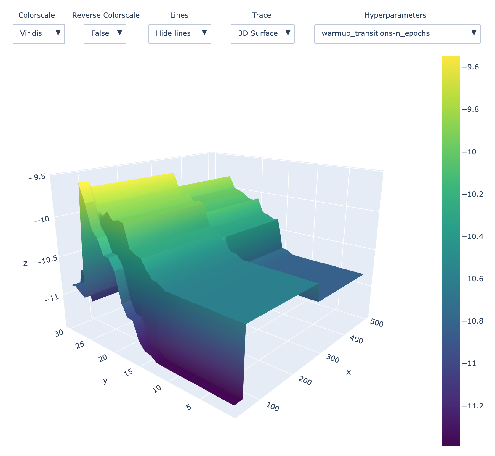

**********
ARLO
**********

**ARLO: Automated Reinforcement Learning Optimizer.**

This is the repository containing the code for running the experiments of the paper ``ARLO: A Framework for Automated Reinforcement Learning``.

What is ARLO
============
ARLO is a Python library for Automated Reinforcement Learning.

The full documentation can be downloaded `here <https://github.com/arlo-lib/ARLO/blob/main/ARLO_documentation.pdf>`_.

You can find the site `here <https://arlo-lib.github.io/arlo-lib/>`_.

Installation
============
You can install ``ARLO`` via: 

.. code:: shell

    pip3 install -e /path/to/ARLO

If you don't have MuJoCo installed you need to `install <https://mujoco.org/download>`_ it. 
Moreover Python >= 3.7 is needed.

The library is tested over macOS and Linux.

Running Experiments
===================
You can find the code needed to run the experiments of the paper in the folder ``experiments``. In order to be able to run the
experiments you need to install ``ARLO``. 

The only thing you need to configure in order to run experiments is the value of the variable ``dir_chkpath``, present in the first line
after the main guard in each script, which is the path to the folder used to save the outputs of the experiments. 

Moreover in the folder ``experiments`` there is a sub-folder named ``plotting scripts`` that contains the scripts used to generate the
plots and the tables present in the paper.

Examples
========
Before diving into the ``experiments`` you may want to checkout the folder ``examples`` where simple examples of usage of ``ARLO``
are present.

Supported Blocks
================
* Data Generation: Random Uniform Policy, MEPOL `[Mutti et al., 2021] <https://github.com/muttimirco/mepol/tree/303fb69d90e03cbb45a4619c1ed3843735f640ba>`_

* Data Preparation: Identity Block, 1-KNN Imputation, Mean Imputation.

* Feature Engineering: Identity Block, Recursive Feature Selection `[Castelletti et al., 2011] <https://re.public.polimi.it/retrieve/handle/11311/635835/161137/Castelletti%20et%20al._Unknown_Tree-based%20Variable%20Selection%20for%20Dimensionality%20Reduction%20of%20Large-scale%20Control%20Systems.pdf>`_, 
  Forward Feature Selection via Mutual Information `[Beraha et al., 2019] <https://arxiv.org/abs/1907.07384>`_, 
  Nystroem Map Feature Generation.

* Model Generation: FQI, DoubleFQI, LSPI, DQN, PPO, DDPG, SAC, GPOMDP (`MushroomRL <https://github.com/MushroomRL/mushroom-rl>`_).

* Metric: TD Error, Discounted Reward, Time Series Rolling Discounted Reward.

* Tuner: Genetic Algorithm, `Optuna <https://github.com/optuna/optuna>`_.

* Input Loader: Load same environment, Load same dataset, Load bootstrapped dataset, Load bootstrapped dataset of different lenghts
  and combinations of the above.

* Environment: Grid World, Car On Hill, Cart Pole, Inverted Pendulum, 
  `LQG <https://github.com/T3p/potion/blob/master/potion/envs/lq.py>`_, HalfCheetah, Ant, Hopper, Humanoid, Swimmer, Walker2d.

Other than the blocks there are also other implemented capabilities in the library: 

* Saving and loading of all objects

* Creations of plots with the performance obtained throughout the learning procedure of Online Model Generation blocks

* Creations of heatmaps showcasing the impact of pairs of hyper-parameters on the peformance of the optimal configuration obtained
  in a Tunable Unit of an Automatic Unit. An example is shown below:

Why you should use ARLO
=======================
* It is well written and documented
 
* Given that AutoML (and thus AutoRL) are very computationally expensive ARLO tries to optimize as much as it can all the operations. 
  For example you can extract a dataset with a Data Generation block in parallel, you can learn RL algorithms in parallel, you can 
  evaluate blocks in parallel and so on and so forth.
 
* It is ``fully`` extendable: anything (a block, a RL algorithm, a tuner, a metric, an environment, and so on and so forth) can be 
  made up into a Block compatible with the framework and the library.
  Practically, you are not bound to a specific set of RL algorithms, or to a specific tuner, as it happens with many AutoML libraries.